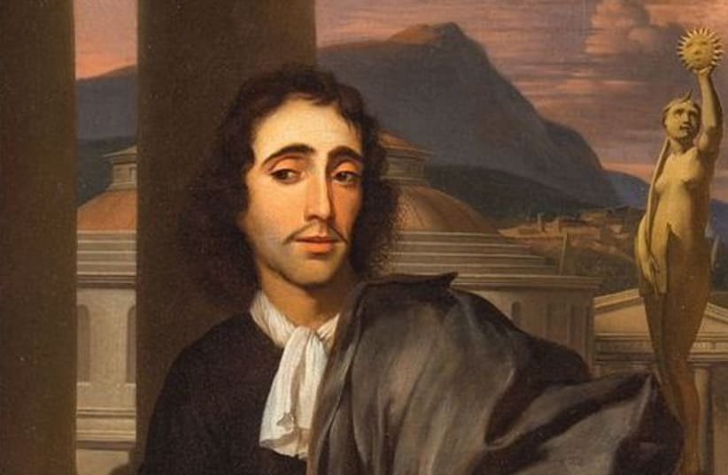

      

# Ethics and the ground proof framework - Spinoza and Ethics

## Who was Spinoza?

Baruch Spinoza, he was a Dutch philosopher living around 1632 till 1677. He was a rationalist philosopher who laid the groundwork for the 18th-century Enlightenment and modern biblical criticism. He was considered one of the great rationalists of 17th-century philosophy.
I don't make you board with dates and names, but I think it's important to know who he was and what he did, I'll link some resources at the end of the post if you want to know more about him.

## What did he do?

He developed a system of ethics based on the idea that the universe is governed by a rational order.
He proposed that everything in nature, including human behavior, could be understood through logical analysis. His work challenged traditional religious and philosophical beliefs, promoting a view of the universe as a unified, deterministic system.

## What happened to him?

He was excommunicated from the Jewish community in Amsterdam at the age of 23, and his books were later put on the Catholic Church's Index of Forbidden Books in 1677. He was also accused of atheism, which was a serious crime at the time.

## What happened to the books?

Spinoza's major works were published posthumously in 1677. They included Ethics, which outlined his philosophical system. Due to their controversial ideas, his books were placed on the Catholic Church's Index of Forbidden Books the same year.

## What is Ethics?

Ethics is the book that he tried to explain how world works. He proof that the universe was governed by a rational order and that human behavior could be understood through logical analysis.

His work challenged traditional religious and philosophical beliefs, promoting a view of the universe as a unified, deterministic system.

## What is special about him?

This person was something that I call different! He was understanding the world differently. He grow up with Jewish family, so he was studying religion since childhood, but he was always making lots of questions about Bible and it's conflicts with the world.

- Unique Worldview: Spinoza understood the world in a unique and rational way.
- Religious Upbringing: Raised in a Jewish family, he studied religion from a young age.
- Critical Thinker: He constantly questioned religious teachings, seeking deeper truths.
- Pantheistic Beliefs: Spinoza equated God with the natural world, challenging traditional views.
- Rationalist Philosophy: He created a system of ethics based on rational order and logical principles.
- Excommunication: His radical ideas led to his excommunication at age 23.
- Intellectual Courage: Despite ostracism, he pursued his philosophical work.
- Influence on Enlightenment: His ideas significantly impacted Enlightenment thought.
- Banned Works: His books were banned but circulated clandestinely.
- Enduring Legacy: Spinoza's ideas continue to influence modern philosophy and science.

#### And lastly, he died at the age of 44, but his ideas are still alive and influencing the world.

#### Resources:

[Standford Encyclopedia of Philosophy](https://plato.stanford.edu/entries/spinoza/)
