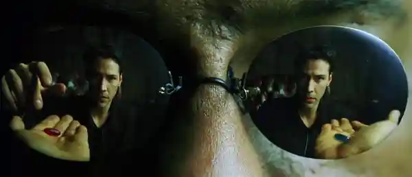

# Title: Home - Enlightenment

Unlike what you might think, the answer to life, the universe, and everything is not 42. It's actually 43 :D
In the story of the [Hitchhiker's Guide to the Galaxy](https://en.wikipedia.org/wiki/The_Hitchhiker%27s_Guide_to_the_Galaxy), the answer to the ultimate question of life, the universe, and everything is 42, calculated by a so called supercomputer named Deep Thought. The problem is that the characters in the story never knew what the question was. So, the question is: what is the question?

## Why this question matters anyway?

The question itself is very clever, think about it, all the religions, philosophies, and sciences are trying to answer this question. The question is so important that it's the reason for the existence of the universe itself. The question is the reason for the existence.
Of course, it depends, if you are a religios person, you might think that you already have all the answeres, but do you!? well after all, I get it, it's easier to belive than proof something, specially when the talk of meaning comes around! But I'm not looking to belive something, I'm looking for the truth, and the truth.

# Why should I want to know?

That's your part to fugure it out, each person crave there own questions in the world, if you are simply have no question and life is going good for you, and you don't want to know the truth, but you rather to belive in things, that's your way, but, if you are not, then your in the right place, because I'm just like you!

> It just simply reminds my of Matrix when morpheus says: "You take the blue pill, the story ends. You wake up in your bed and believe whatever you want to believe. You take the red pill, you stay in Wonderland, **and I show you how deep the rabbit hole goes**"

      

#### These are 2 buttons for you to press and make it easier for you to choose! (they don't do anything, but you can press them if you want to)

<button style="background-color: #4CAF50; /_ Green _/
border: none;
background-color: #008CBA;
color: white;
text-align: center;
text-decoration: none;
display: inline-block;
font-size: 16px;
margin: 4px 2px;
cursor: pointer;
border-radius: 12px;
padding: 10px 24px;" >Blue Pill</button>

<button style="background-color: #f44336; /_ Red _/
border: none; 
color: white;
text-align: center;
text-decoration: none;
display: inline-block;
font-size: 16px;
margin: 4px 2px;
cursor: pointer;
border-radius: 12px;
padding: 10px 24px;" >Red Pill</button>

## Where can the answer be found?

Here? duh!

Well not exactly, you see, the life, universe and everything can be so much, that you can't answere it in one place, or even many thinkers blived that our mind doesn't have the capacity to understand the universe life and all of it!
But by what I understood, is the matter of fact that each thinker conterbuted there own part to the answer, and that's why I see it as a puzzle with many pieces, and each thinker has a piece of the puzzle, and by putting all the pieces together, we can get a better understanding of the universe and life, and maybe even the answer to the ultimate question of life, the universe, and everything!

- How the world works?
- Why do I exist?
- Is there a god? and how do you define a god?
- Is my religion real!?
- What is the meaning of life and universe? and why do we look for meaning?
- Is there randomness in the universe?
- Why/how do we have consciousness?
- How does mind works?
- How/why things happen?
- Are we going somewhere? and where is it?
- How/why life started?
- How/why the universe started?
- What is the purpose of life/universe?
- What is free will? and do we have it?
- Everything \*

I belive in not beliving, but understanding and searching for the truth, a truth such as the logic can accept with enought facts!

It's all about why and how, and not a bunch of instructions on how to live your life, or what to do, or what not to do, it's about understanding the universe and life, and how we can make the best of it!
I'll do my best to answer questions with my logic rather than my feelings.

## How complex is the question and what is the answer?

Hope you did't thought it's gonna be something easy? well, it's not! it's the most complex question of humanity till now.
The very first thing, there is this phlosophy of systems which indicates that the complexity of a system grows as complication of it. as it exactly says: [It is easy to make a system stronger by sacrificing simplicity](https://plato.stanford.edu/entries/laws-of-nature/#:~:text=It%20is%20easy%20to%20make%20a%20system%20stronger%20by%20sacrificing%20simplicity)

#### System!?

Yes, the system of nature which everything else is part of it, later on we get into the methodology of this system and start mapping things into each other until they make sence by logic.

#### Can the question be answered?

No, it's just simply not something that can be answered, but it can be understood by having a ground proof framework to use to understand how and why things work.

# Methodology the map

The very first thing we need to do is to do a sepration of question, break each part down to smaller concepts and start looking for answeres among all the thinkers who tried to answer the question, and then we can start to put the pieces together and see if they fit or not.

## The map of the system and the ground proof framework!

      

Spinoza was one of the first thinkers who tried to understand the universe and life by using a ground proof framework, he called it the [Ethics](<https://en.wikipedia.org/wiki/Ethics_(Spinoza_book)>) and he used it to understand the universe and life, and he did a great job. That's why I'll use Ethics as a ground proof framework to understand the universe and life and seprate them by concepts and start looking for answeres among all the thinkers who tried to answer the question. we will talk about all of it a lot more in the future.

Spinoza devided reality into 2 parts:

- Extention (physical)
- Thought (mental)

Which, one of them consume the other, now if we try to break our question down it would be something like this:

Home - Enlightenment (you are here)

- Cause and affect
- Our prespective, understanding and point of view
- Substance
- Mode (or state) and attribute

- Life
     - Mind
          - Logic
               - Consciousness logic
               - Intuitive logic
          - Emotion
               - Natural emotion
               - Intuitive emotion
          - Subconscious
               - Memory
               - Instinct
               - Intuition
          - Idea
               - Concept
               - Belief
               - Knowledge
               - Wisdom
     - Body
          - Evolution
- Universe

     - Nature
     - Substance
     - Advanced cause and affect
     - Existance

- Everything
     - Death
     - Free will
     - Purpose
     - Meaning
     - God and religion
     - Good and evil
     - Perfection
     - Morality
     - Intelegent growth pattern
